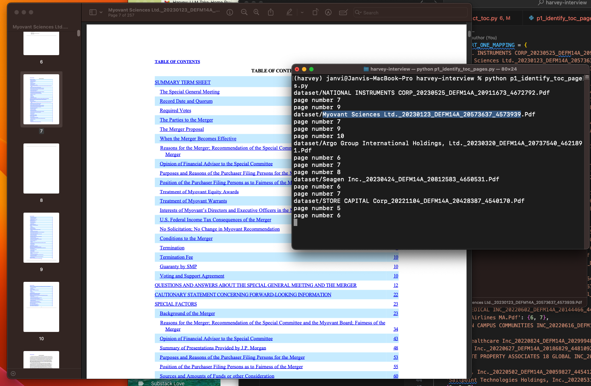
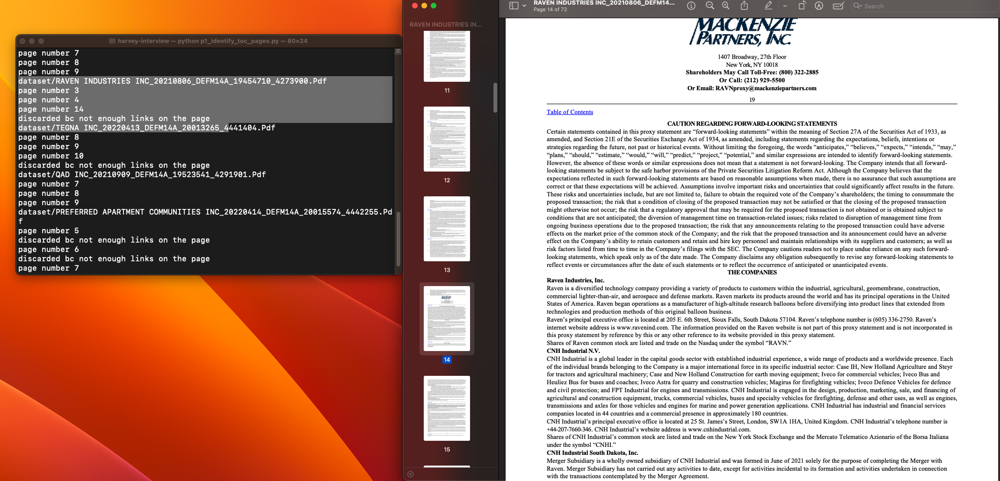
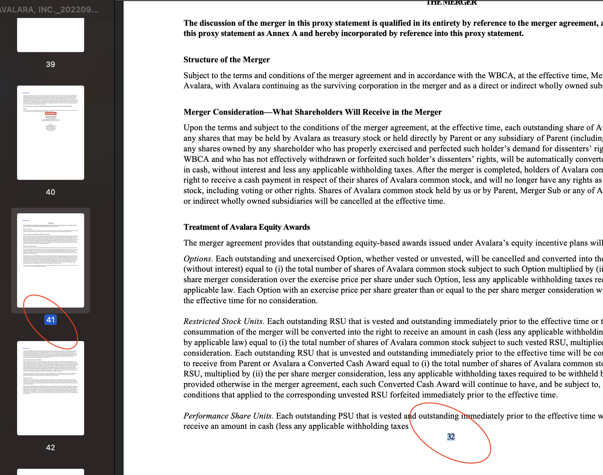
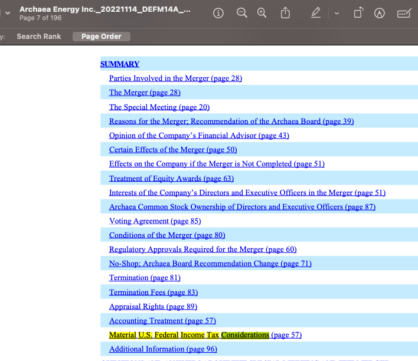
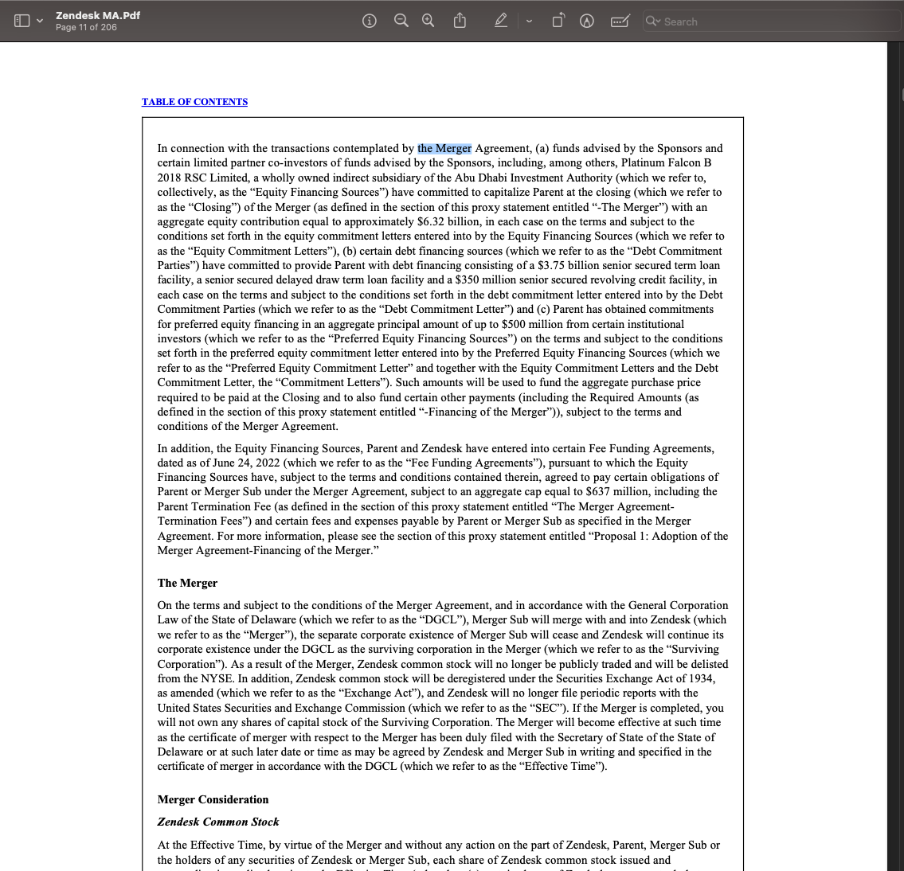

# harvey-interview

## High Level Approach

1. Use an LLM to identify which pages in a PDF are part of the Table of Contents (TOC). Implemented in `p1_identify_toc_pages.py`

2. On the identified TOC pages from step 1, use an LLM to extract the section header names and referenced page numbers. Use PyNumPDF's link library to extract the _real_ zero-indexed page number. Add columns to their respective CSV files. Implemented in `p2_extract_toc.py`

3. Populate the section body by identifying the text between two sections in the TOC.   Ex: If Section A starts on page X and Section B starts on page Y, then the section body of Section A is the text between pages X and Y (inclusive), trimmed down a bit. Implemented in `p3_crawl_text.py`

4. [extra-credit] Classify the section body from step 3 as 'Termination', 'Indemnification', or 'Confidentiality' with an LLM

## Implementation Details: Decisions, Assumptions, Limitations, and Edge Cases

### Step 1: Identify TOC

As seen in this screenshot, part 1 successfully identifies non-continuous table of contents pages in a PDF (page 7, 8, 10 in the image). It successfully skips blank pages like page 8 and pages of text like page 11.

 

- [Assumption] Assume that TOC of a PDF lives in the first 20 pages of the PDF. With this assumption, we only need to run the LLM classification on the first 20 pages of the PDF. Assumed this because each LLM call is time and resource intensive, so it saves us time and money to call it on 20 pages rather than 100s of pages. Further, looked at the dataset to confirm that this was a reasonable assumption

- [Decision] Split identification of TOC pages (step 1) and extraction of TOC structure (step 2) into two different steps. This enabled me to tune the LLM prompts for each specific tasks

- [Assumption / Limitation / Edge Case] The LLM leaned towards _false positives_ when identifying TOC pages. To help with this, if the LLM classified a page as a TOC page, I added an extra check to see whether the page has at least 1 link. If not, then it is not a TOC page. This helped reduce the false positives immensely. A limitation, however, is that this is based on the assumption that TOCs are a list of links.

  For example, in the screenshot below you can see that this method successfully disregarded "page 14" - a false positive triggered by the (page x) citations on the page

    

- [Decision] Save the results of the TOC page map into `p1_identify_toc_pages.py` rather than making it one continuous execution between step 1 and step 2. Given that LLMs are non-deterministic, the accuracy of step 1 is not guaranteed. Saving the results into `p1_identify_toc_pages` enabled me to run step 1 multiple times and choose the _most accurate_ run of step 1. This is crucial because the results of step 2 and 3 are hinged on the accuracy of step 1, so an inaccuracy here can lead to exponential downstream errors.

- [Decision] Added examples into the prompt as I found this improved the accuracy

### Step 2: Extract TOC

As seen in the screenshot, part 2 successfully identifies the section header, referenced page number as well as the zero-indexed page number. Given that there can be duplicate section header names that reference different parts of the document, the algorithm takes care to account for duplicates as seen in "the merger" example.

- [Decision] Include the referenced page numbers and _real_ zero-indexed page number for a section header because they're different and both provide meaningful information. Referenced page numbers is the number at the bottom of the page on the printed PDF, the zero-indexed page number is the number the digital version of the PDf uses. Notice the difference here:

  

- [Assumption / Limitation] Continued the assumption from step 1 that a TOC is a list of links. Without this assumption, I would not be able to identify the _real_ zero-indexed page number of a section. This is limitation for PDFs that have unlinked TOCs like `PREFERRED APARTMENT COMMUNITIES INC_20220414_DEFM14A_20015574_4442255` but worked very well for all other examples in the dataset.

- [Decision] Given that an LLM (non-deterministic) is doing most of the heavy lifting here, it may generate an invalid JSON representation of the structured TOC. Hence, if the section name returned by the LLM doesn't have a link in the TOC, it most likely hallucinated the section name, so skip that name to the CSV.

- [Edge Case] The section name returned by the LLM and the section title in the TOC is likely to have different escape characters, so `clean()` both strings

- [Edge Case] The LLM is great at returned the section name and excluding the the page references. Some of the PDFs, however, include the page number in the link name. Hence, check to see whether section name is _a substring_ of the name in the link.

  This is an example of where that matters: the LLM will return "Material U.S. Federal Income Tax Considerations" and so if we were to do an exact string page it would fail because the LLM section name is missing "(page 57)". Doing a substring match fixes this edge case.

  

### Step 3: Populate Section Body and Classify

- [Decision / Limitation] The text between `Section_n_Page_Start` and `Section_n+1_Page_Start` and _overestimates_ the text under section `n`. It is crucial to trim down the text by removing the text before `section_n_title` and after `section_n+1_title`, using the trim functions I implemented. One limitation, however, is that we're matching by section name, and so if the section name appears in a paragraph other than the section name, the trimming will be off by a couple paragraphs.

  For example, in the example below, "the merger" appears on the last page before "The Merger" section name, so we will over trim the section body contents.
  We can improve this limitation by using regex matching so that we take into account. Hence, in the example below, we will not trim at the highlighted section because of the case difference.
  Still, there will be cases where the case matches the section title exactly and in those instances our section body column will be missing a couple sentences.

    

- [Decision] When classifying the section body as Termination/Indemnification/Confidentiality, the section body can be very large (ex: spanning 10 PDF pages). The LLM has a max context window, so truncate the section body using the 1 token ~= 4 chars estimation/assumption. Add a 5,000 char buffer to account for the system prompt because that contributes to the context window as well.

- [Edge Case] In classifying the section body, the LLM sometimes returns "Termination." or "None". Hence, rather than doing as extract string comparison, check to see whether "Termination" is a substring of the returned answer.

## Repro Steps

1. Run `p1_identify_toc_pages`. This will generate a dictionary of zero-indexed page-numbers for each PDF that represents the pages where the TOC lives. Save the results printed out in `part1_results.py`

2. Run `p2_extract_toc.py`. This will generate a CSV for each PDF with the section headers and respective page numbers populated.

   Given that an LLM (non-deterministic) is doing most of the heavy lifting here, it may generate an invalid JSON representation of the structured TOC, and when it does, the filename is printed out. Thus, once the program runs on all PDFs in `dataset/`, retry the program on the specific failed PDFs via the commented out code under "Retry on failed PDFs"

   

3. Run `p3_crawl_text.py`. This populates the section body and classification columns for each row in the CSV.
